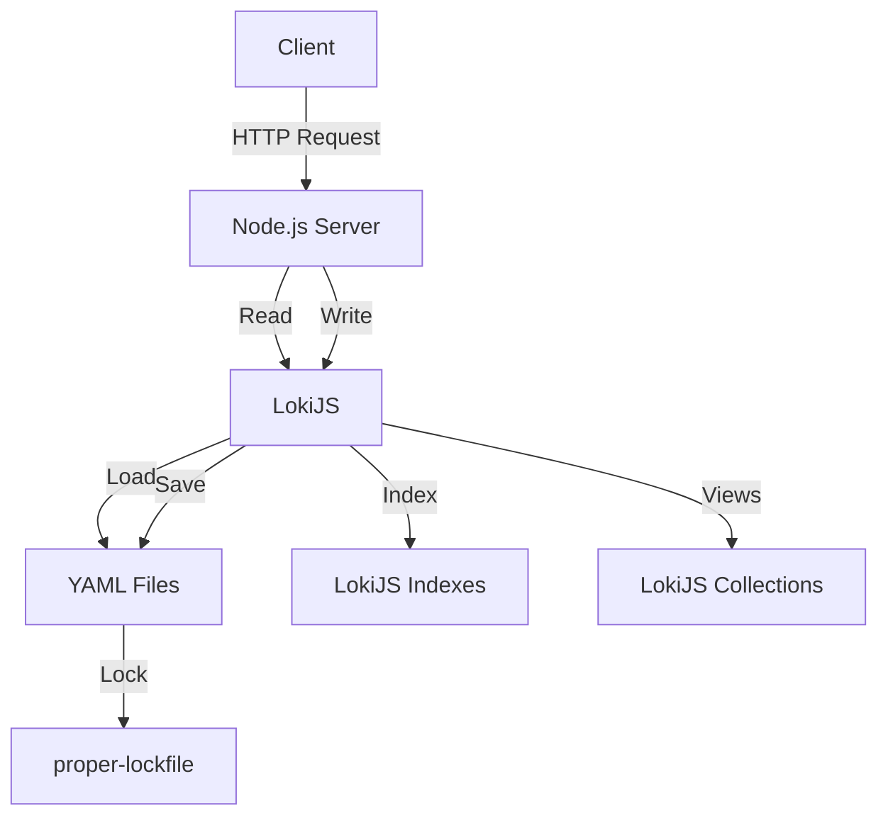

# Flat Files DB Backend Principles

---

**Version** : 1.1  
**Last Updated** : June 26, 2026  
**Author** : Oswald Bernard (Steroids Studio)  
**Technologies** : Node.js, LokiJS, YAML, `proper-lockfile`

---

## 📌 1. Overview

### 1.1 System Description
This system allows you to **manage invoices and payers** stored as **individual YAML files** (one file per invoice or payer) with:
- **Automatic indexes** to speed up queries (via LokiJS).
- **Materialized views** for frequent queries (e.g., unpaid invoices, invoices per payer).
- **Locking mechanism** to handle concurrent writes (via `proper-lockfile`).
- **Reliable persistence** of data on disk.
- **Relationships** between payers and invoices using references by ID.

### 1.2 Architecture
```
backend/
├── factures/               # Directory for invoices (1 YAML file = 1 invoice)
│   ├── facture_1.yml
│   ├── facture_2.yml
│   └── ...
├── payers/                 # Directory for payers (1 YAML file = 1 payer)
│   ├── payer_1.yml
│   ├── payer_2.yml
│   └── ...
├── db.json                # LokiJS file (metadata + in-memory indexes)
├── server.js              # Entry point for the server (REST API)
└── package.json
```

### 1.3 Data Flow


---

## 🛠️ 2. Prerequisites

### 2.1 Environment
- **Node.js**: Version 18+ (recommended for modern features).
- **NPM/Yarn**: For dependency management.
- **File System**: Read/write access (for YAML files and locks).

### 2.2 Dependencies
| **Package**            | **Version** | **Role**                                                                 |
|------------------------|-------------|--------------------------------------------------------------------------|
| `lokijs`               | ^1.5.11     | In-memory NoSQL database with index support.               |
| `js-yaml`              | ^4.1.0      | Parsing and serialization of YAML files.                            |
| `proper-lockfile`      | ^4.1.2      | Locking mechanism for concurrent writes.                   |
| `express`              | ^4.18.2     | HTTP server to expose a REST API (optional).                   |

**Installation**:
```bash
npm install lokijs js-yaml proper-lockfile express
```

---

## 📦 3. Data Structure

### 3.1 Invoice Format (YAML)
Each invoice is stored in a **separate YAML file** (`factures/facture_{id}.yml`).

**Example** (`factures/facture_1.yml`):
```yaml
id: 1
montant: 100.50
date: "2026-06-26"       # Format: YYYY-MM-DD
client: "Client A"
statut: "non payée"       # Possible values: "payée", "non payée", "annulée"
payer_id: 1             # Reference to the payer with id=1
```

### 3.2 Payer Format (YAML)
Each payer is stored in a **separate YAML file** (`payers/payer_{id}.yml`).

**Example** (`payers/payer_1.yml`):
```yaml
id: 1
nom: "Société Alpha"
email: "contact@alpha.com"
adresse: "123 Rue de Paris"
```

### 3.3 LokiJS Collections
| **Collection**          | **Role**                                                                 | **Indexes**                          | **Associated Views**               |
|-------------------------|--------------------------------------------------------------------------|------------------------------------|----------------------------------|
| `payers`                | Main collection containing all payers.                     | `id` (unique), `nom`               | -                                |
| `factures`              | Main collection containing all invoices.                     | `id` (unique), `payer_id`, `client`, `date`, `statut` | `factures_non_payees`, `factures_par_payer` |
| `factures_non_payees`  | Materialized view of invoices with `statut = "non payée"`.              | `date`                             | -                                |
| `factures_par_payer`   | Materialized view grouping invoices by `payer_id`.                 | `payer_id`                          | -                                |

### 3.4 Indexes
- **Unique Indexes**:
  - `id` in `payers` and `factures`: Ensures each payer/invoice has a unique identifier.
- **Standard Indexes**:
  - `payer_id`, `client`, `date`, `statut` in `factures`: To speed up frequent queries.
  - `nom` in `payers`: To speed up payer searches.

---

## 🔧 4. System Functionality

### 4.1 Database Initialization
On server startup, LokiJS:
1. Loads **YAML files** from `payers/` and `factures/` into their respective collections.
2. **Rebuilds indexes** in memory.
3. **Populates materialized views** (`factures_non_payees`, `factures_par_payer`).

**Code**:
```javascript
const loki = require('lokijs');
const fs = require('fs');
const path = require('path');
const yaml = require('js-yaml');

const FACTURES_DIR = path.join(__dirname, 'factures');
const PAYERS_DIR = path.join(__dirname, 'payers');
if (!fs.existsSync(FACTURES_DIR)) fs.mkdirSync(FACTURES_DIR);
if (!fs.existsSync(PAYERS_DIR)) fs.mkdirSync(PAYERS_DIR);

const db = new loki('db.json');

// Collections
const payers = db.addCollection('payers', {
  indices: ['id', 'nom'],
  unique: ['id']
});

const factures = db.addCollection('factures', {
  indices: ['payer_id', 'client', 'date', 'statut'],
  unique: ['id']
});

// Materialized views
const facturesNonPayees = db.addCollection('factures_non_payees');
facturesNonPayees.createIndex('date');

const facturesParPayer = db.addCollection('factures_par_payer');
facturesParPayer.createIndex('payer_id');

// Load payers from YAML files
const payerFiles = fs.readdirSync(PAYERS_DIR).filter(f => f.endsWith('.yml'));
payerFiles.forEach(file => {
  const data = yaml.load(fs.readFileSync(path.join(PAYERS_DIR, file), 'utf-8'));
  payers.insert(data);
});

// Load invoices from YAML files
const factureFiles = fs.readdirSync(FACTURES_DIR).filter(f => f.endsWith('.yml'));
factureFiles.forEach(file => {
  const data = yaml.load(fs.readFileSync(path.join(FACTURES_DIR, file), 'utf-8'));
  if (data && data.id) {
    const doc = factures.insert(data);
    // Populate views
    if (data.statut === "non payée") facturesNonPayees.insert(doc);
    let payerDocs = facturesParPayer.findOne({ payer_id: doc.payer_id });
    if (!payerDocs) {
      payerDocs = { payer_id: doc.payer_id, factures: [] };
      facturesParPayer.insert(payerDocs);
    }
    payerDocs.factures.push(doc);
    facturesParPayer.update(payerDocs);
  }
});
```

---

### 4.2 Writing Data (with Locking)
To prevent **write conflicts** (e.g., two processes modifying `facture_1.yml` simultaneously), we use **`proper-lockfile`** to create a **lock per file**.

#### Locking Mechanism
1. **Before any write**:
   - A **lock file** (`facture_{id}.yml.lock` or `payer_{id}.yml.lock`) is created for the concerned file.
   - If the lock already exists, the process **waits** (or fails after a timeout).
2. **After writing**:
   - The lock is **removed**.
3. **Cleanup stale locks**:
   - On startup, remove locks that are **too old** (e.g., > 10 seconds).

**Code**:
```javascript
const lockfile = require('proper-lockfile');

// Cleanup stale locks on startup
function cleanupStaleLocks(dir) {
  const now = Date.now();
  fs.readdirSync(dir)
    .filter(f => f.endsWith('.yml.lock'))
    .forEach(lockFile => {
      const filePath = path.join(dir, lockFile);
      const stats = fs.statSync(filePath);
      // Remove locks older than 10 seconds
      if (now - stats.mtimeMs > 10000) {
        fs.unlinkSync(filePath);
      }
    });
}

cleanupStaleLocks(FACTURES_DIR);
cleanupStaleLocks(PAYERS_DIR);

// Save a payer
async function savePayer(payer) {
  const lockFile = path.join(PAYERS_DIR, `${payer.id}.yml.lock`);
  const filePath = path.join(PAYERS_DIR, `${payer.id}.yml`);

  try {
    await lockfile.lock(lockFile, { stale: 5000 });
    fs.writeFileSync(filePath, yaml.dump(payer, { sortKeys: true }));
    await lockfile.unlock(lockFile);
    return { success: true };
  } catch (err) {
    await lockfile.unlock(lockFile).catch(() => {});
    return { success: false, error: err.message };
  }
}

// Save an invoice
async function saveFacture(facture) {
  const lockFile = path.join(FACTURES_DIR, `${facture.id}.yml.lock`);
  const filePath = path.join(FACTURES_DIR, `${facture.id}.yml`);

  try {
    await lockfile.lock(lockFile, { stale: 5000 });
    fs.writeFileSync(filePath, yaml.dump(facture, { sortKeys: true }));
    await lockfile.unlock(lockFile);
    return { success: true };
  } catch (err) {
    await lockfile.unlock(lockFile).catch(() => {});
    return { success: false, error: err.message };
  }
}
```

---

### 4.3 Updating Views
Materialized views (`factures_non_payees`, `factures_par_payer`) are **automatically updated** via LokiJS event listeners:

```javascript
// Listen for insertions
factures.on('insert', (facture) => {
  if (facture.statut === "non payée") facturesNonPayees.insert(facture);
  let payerDocs = facturesParPayer.findOne({ payer_id: facture.payer_id });
  if (!payerDocs) {
    payerDocs = { payer_id: facture.payer_id, factures: [] };
    facturesParPayer.insert(payerDocs);
  }
  payerDocs.factures.push(facture);
  facturesParPayer.update(payerDocs);
});

// Listen for updates
factures.on('update', (facture) => {
  // Update "non payées" view
  const oldInView = facturesNonPayees.findOne({ id: facture.id });
  if (oldInView) facturesNonPayees.remove(oldInView);
  if (facture.statut === "non payée") facturesNonPayees.insert(facture);

  // Update "par payer" view (payer may have changed)
  const oldFacture = factures.findOne({ id: facture.id });
  if (oldFacture && oldFacture.payer_id !== facture.payer_id) {
    // Remove from old payer
    const oldPayerDocs = facturesParPayer.findOne({ payer_id: oldFacture.payer_id });
    if (oldPayerDocs) {
      oldPayerDocs.factures = oldPayerDocs.factures.filter(f => f.id !== facture.id);
      facturesParPayer.update(oldPayerDocs);
    }
    // Add to new payer
    let newPayerDocs = facturesParPayer.findOne({ payer_id: facture.payer_id });
    if (!newPayerDocs) {
      newPayerDocs = { payer_id: facture.payer_id, factures: [] };
      facturesParPayer.insert(newPayerDocs);
    }
    if (!newPayerDocs.factures.some(f => f.id === facture.id)) {
      newPayerDocs.factures.push(facture);
      facturesParPayer.update(newPayerDocs);
    }
  }
});

// Listen for deletions
factures.on('delete', (facture) => {
  const docInView = facturesNonPayees.findOne({ id: facture.id });
  if (docInView) facturesNonPayees.remove(docInView);
  const payerDocs = facturesParPayer.findOne({ payer_id: facture.payer_id });
  if (payerDocs) {
    payerDocs.factures = payerDocs.factures.filter(f => f.id !== facture.id);
    facturesParPayer.update(payerDocs);
  }
});
```

---

### 4.4 Saving Data
The `saveDatabase()` method in LokiJS is **overridden** to:
1. Save each modified invoice or payer to its YAML file.
2. Use locks to prevent conflicts.

**Code**:
```javascript
class YamlPerDocAdapter {
  constructor(facturesDir, payersDir) {
    this.facturesDir = facturesDir;
    this.payersDir = payersDir;
    this.modifiedFactures = new Set();
    this.modifiedPayers = new Set();
  }

  loadDatabase(dbname, callback) {
    // ... (see section 4.1)
  }

  async saveDatabase(dbname, db, callback) {
    const factures = db.getCollection('factures');
    const payers = db.getCollection('payers');
    const errors = [];

    // Save modified payers
    for (const id of this.modifiedPayers) {
      const lockFile = path.join(this.payersDir, `${id}.yml.lock`);
      const filePath = path.join(this.payersDir, `${id}.yml`);
      try {
        await lockfile.lock(lockFile, { stale: 5000 });
        const payer = payers.findOne({ id: id });
        if (payer) {
          fs.writeFileSync(filePath, yaml.dump(payer, { sortKeys: true }));
        } else {
          if (fs.existsSync(filePath)) fs.unlinkSync(filePath);
        }
        await lockfile.unlock(lockFile);
      } catch (err) {
        errors.push({ id, type: 'payer', error: err.message });
        await lockfile.unlock(lockFile).catch(() => {});
      }
    }

    // Save modified invoices
    for (const id of this.modifiedFactures) {
      const lockFile = path.join(this.facturesDir, `${id}.yml.lock`);
      const filePath = path.join(this.facturesDir, `${id}.yml`);
      try {
        await lockfile.lock(lockFile, { stale: 5000 });
        const facture = factures.findOne({ id: id });
        if (facture) {
          fs.writeFileSync(filePath, yaml.dump(facture, { sortKeys: true }));
        } else {
          if (fs.existsSync(filePath)) fs.unlinkSync(filePath);
        }
        await lockfile.unlock(lockFile);
      } catch (err) {
        errors.push({ id, type: 'facture', error: err.message });
        await lockfile.unlock(lockFile).catch(() => {});
      }
    }

    this.modifiedFactures.clear();
    this.modifiedPayers.clear();
    callback(errors.length > 0 ? new Error(`Errors: ${JSON.stringify(errors)}`) : null);
  }
}

// Initialize LokiJS with the adapter
const adapter = new YamlPerDocAdapter(FACTURES_DIR, PAYERS_DIR);
const db = new loki('db.json', { adapter: adapter });
```

---

## 🔌 5. REST API
To expose functionality via an **HTTP API**, use **Express**:

```javascript
const express = require('express');
const app = express();
app.use(express.json());

// --- Payers Endpoints ---

// Get all payers
app.get('/payers', (req, res) => {
  const allPayers = payers.find();
  res.json(allPayers);
});

// Get a payer by ID
app.get('/payers/:id', (req, res) => {
  const payer = payers.findOne({ id: parseInt(req.params.id) });
  if (!payer) return res.status(404).json({ error: "Payer not found" });
  res.json(payer);
});

// Add a payer
app.post('/payers', async (req, res) => {
  try {
    const payer = req.body;
    if (!payer.id || !payer.nom) {
      return res.status(400).json({ error: "Missing required fields: id, nom" });
    }
    const existing = payers.findOne({ id: payer.id });
    if (existing) {
      return res.status(409).json({ error: "Payer already exists" });
    }
    payers.insert(payer);
    await new Promise((resolve, reject) => {
      db.saveDatabase((err) => err ? reject(err) : resolve());
    });
    res.json({ success: true, id: payer.id });
  } catch (err) {
    res.status(500).json({ error: err.message });
  }
});

// Update a payer
app.put('/payers/:id', async (req, res) => {
  try {
    const id = parseInt(req.params.id);
    const updates = req.body;
    const payer = payers.findOne({ id });
    if (!payer) return res.status(404).json({ error: "Payer not found" });
    Object.assign(payer, updates);
    payers.update(payer);
    await new Promise((resolve, reject) => {
      db.saveDatabase((err) => err ? reject(err) : resolve());
    });
    res.json({ success: true });
  } catch (err) {
    res.status(500).json({ error: err.message });
  }
});

// Delete a payer
app.delete('/payers/:id', async (req, res) => {
  try {
    const id = parseInt(req.params.id);
    const payer = payers.findOne({ id });
    if (!payer) return res.status(404).json({ error: "Payer not found" });
    // Check if payer has invoices
    const payerInvoices = factures.find({ payer_id: id });
    if (payerInvoices.length > 0) {
      return res.status(400).json({ error: "Cannot delete payer with associated invoices" });
    }
    payers.remove(payer);
    await new Promise((resolve, reject) => {
      db.saveDatabase((err) => err ? reject(err) : resolve());
    });
    res.json({ success: true });
  } catch (err) {
    res.status(500).json({ error: err.message });
  }
});

// --- Invoices Endpoints ---

// Get all invoices
app.get('/factures', (req, res) => {
  const allFactures = factures.find();
  res.json(allFactures);
});

// Get an invoice by ID
app.get('/factures/:id', (req, res) => {
  const facture = factures.findOne({ id: parseInt(req.params.id) });
  if (!facture) return res.status(404).json({ error: "Invoice not found" });
  res.json(facture);
});

// Get unpaid invoices
app.get('/factures/non-payees', (req, res) => {
  const nonPayees = facturesNonPayees.find();
  res.json(nonPayees);
});

// Get invoices by payer
app.get('/payers/:payerId/factures', (req, res) => {
  const payerId = parseInt(req.params.payerId);
  const payerFactures = facturesParPayer.findOne({ payer_id: payerId })?.factures || [];
  res.json(payerFactures);
});

// Add an invoice
app.post('/factures', async (req, res) => {
  try {
    const facture = req.body;
    if (!facture.id || !facture.montant || !facture.date || !facture.client || !facture.payer_id) {
      return res.status(400).json({ error: "Missing required fields: id, montant, date, client, payer_id" });
    }
    // Check if payer exists
    const payer = payers.findOne({ id: facture.payer_id });
    if (!payer) {
      return res.status(404).json({ error: "Payer not found" });
    }
    const existing = factures.findOne({ id: facture.id });
    if (existing) {
      return res.status(409).json({ error: "Invoice already exists" });
    }
    factures.insert(facture);
    await new Promise((resolve, reject) => {
      db.saveDatabase((err) => err ? reject(err) : resolve());
    });
    res.json({ success: true, id: facture.id });
  } catch (err) {
    res.status(500).json({ error: err.message });
  }
});

// Update an invoice
app.put('/factures/:id', async (req, res) => {
  try {
    const id = parseInt(req.params.id);
    const updates = req.body;
    const facture = factures.findOne({ id });
    if (!facture) return res.status(404).json({ error: "Invoice not found" });
    // Check if payer_id is being updated and if the new payer exists
    if (updates.payer_id && updates.payer_id !== facture.payer_id) {
      const newPayer = payers.findOne({ id: updates.payer_id });
      if (!newPayer) {
        return res.status(404).json({ error: "New payer not found" });
      }
    }
    Object.assign(facture, updates);
    factures.update(facture);
    await new Promise((resolve, reject) => {
      db.saveDatabase((err) => err ? reject(err) : resolve());
    });
    res.json({ success: true });
  } catch (err) {
    res.status(500).json({ error: err.message });
  }
});

// Update the payer of an invoice
app.put('/factures/:id/payer', async (req, res) => {
  try {
    const id = parseInt(req.params.id);
    const { payer_id } = req.body;
    const facture = factures.findOne({ id });
    if (!facture) return res.status(404).json({ error: "Invoice not found" });
    if (!payer_id) return res.status(400).json({ error: "payer_id is required" });
    // Check if new payer exists
    const newPayer = payers.findOne({ id: payer_id });
    if (!newPayer) return res.status(404).json({ error: "Payer not found" });
    facture.payer_id = payer_id;
    factures.update(facture);
    await new Promise((resolve, reject) => {
      db.saveDatabase((err) => err ? reject(err) : resolve());
    });
    res.json({ success: true });
  } catch (err) {
    res.status(500).json({ error: err.message });
  }
});

// Delete an invoice
app.delete('/factures/:id', async (req, res) => {
  try {
    const id = parseInt(req.params.id);
    const facture = factures.findOne({ id });
    if (!facture) return res.status(404).json({ error: "Invoice not found" });
    factures.remove(facture);
    await new Promise((resolve, reject) => {
      db.saveDatabase((err) => err ? reject(err) : resolve());
    });
    res.json({ success: true });
  } catch (err) {
    res.status(500).json({ error: err.message });
  }
});

app.listen(3000, () => {
  console.log('Server started on http://localhost:3000');
});
```

---

## 📜 6. Usage Examples

### 6.1 Add a Payer
**HTTP Request**:
```bash
curl -X POST http://localhost:3000/payers \
  -H "Content-Type: application/json" \
  -d '{
    "id": 1,
    "nom": "Société Alpha",
    "email": "contact@alpha.com",
    "adresse": "123 Rue de Paris"
  }'
```

**Result**:
- A file `payers/payer_1.yml` is created.

---

### 6.2 Add an Invoice with a Payer
**HTTP Request**:
```bash
curl -X POST http://localhost:3000/factures \
  -H "Content-Type: application/json" \
  -d '{
    "id": 1,
    "montant": 100.50,
    "date": "2026-06-26",
    "client": "Client A",
    "statut": "non payée",
    "payer_id": 1
  }'
```

**Result**:
- A file `factures/facture_1.yml` is created.
- The views `factures_non_payees` and `factures_par_payer` are updated.

---

### 6.3 Get Invoices for a Payer
**HTTP Request**:
```bash
curl http://localhost:3000/payers/1/factures
```

**Result**:
```json
[
  {
    "id": 1,
    "montant": 100.50,
    "date": "2026-06-26",
    "client": "Client A",
    "statut": "non payée",
    "payer_id": 1
  }
]
```

---

### 6.4 Get Unpaid Invoices
**HTTP Request**:
```bash
curl http://localhost:3000/factures/non-payees
```

**Result**:
```json
[
  {
    "id": 1,
    "montant": 100.50,
    "date": "2026-06-26",
    "client": "Client A",
    "statut": "non payée",
    "payer_id": 1
  }
]
```

---

### 6.5 Update the Payer of an Invoice
**HTTP Request**:
```bash
curl -X PUT http://localhost:3000/factures/1/payer \
  -H "Content-Type: application/json" \
  -d '{
    "payer_id": 2
  }'
```

**Result**:
- The `payer_id` of `facture_1.yml` is updated to `2`.
- The views `factures_par_payer` are updated accordingly.

---

## ⚠️ 7. Error Handling and Best Practices

### 7.1 Common Errors and Solutions
| **Error**                          | **Cause**                                  | **Solution**                                                                 |
|------------------------------------|-------------------------------------------|------------------------------------------------------------------------------|
| `Error: ENOENT: no such file or directory` | Missing `factures/` or `payers/` directory. | Create the directories before starting (`fs.mkdirSync`).                  |
| `Error: Lock stale`                 | Lock file blocked for too long.             | Increase timeout (`stale: 10000`) or clean up stale locks.                    |
| `Error: Duplicate key`              | Duplicate `id` in `payers` or `factures`.   | Check for uniqueness of `id` before insertion.                              |
| `Error: YAML parse error`           | Malformed YAML file.                       | Validate YAML before loading (e.g., with `js-yaml.load`).                   |
| `Error: Database not loaded`         | `autoloadCallback` not called.            | Ensure `db.loadDatabase` is called before any operation.                  |
| `Error: Payer not found`            | `payer_id` does not exist.                  | Check if the payer exists before assigning it to an invoice.               |

---

### 7.2 Best Practices
1. **Always use locks**:
   - **Every write operation** (add, update, delete) must be protected by a lock.
   - Use `proper-lockfile` to avoid conflicts.

2. **Clean up stale locks**:
   - On startup, remove locks that are **too old** (e.g., > 10 seconds).

3. **Validate data**:
   - Ensure required fields (`id`, `montant`, `date`, `client`, `payer_id`) are present before insertion.
   - Check that referenced `payer_id` exists.

4. **Save regularly**:
   - Call `db.saveDatabase()` after each modification to persist changes.

5. **Optimize indexes**:
   - Only create indexes on **frequently queried fields** (e.g., `payer_id`, `statut`).

6. **Handle errors**:
   - Use `try/catch` to capture locking or write errors.

7. **Test concurrent scenarios**:
   - Test with **multiple simultaneous PUT requests** on the same invoice or payer.

8. **Avoid orphaned data**:
   - Do not allow deletion of a payer if it has associated invoices.

---

## 📊 8. Performance and Limits

### 8.1 Performance
| **Operation**               | **Complexity** | **Estimated Time (1000 invoices)** | **Optimizations**                          |
|-----------------------------|----------------|-----------------------------------|-------------------------------------------|
| Insert a payer              | O(1)           | ~5 ms                             | Lock per file.                             |
| Insert an invoice           | O(1)           | ~5 ms                             | Lock per file.                             |
| Update a payer              | O(1)           | ~5 ms                             | Lock per file.                             |
| Update an invoice           | O(1)           | ~5 ms                             | Lock per file.                             |
| Query with index            | O(log n)       | ~1-2 ms                           | Use LokiJS indexes.                        |
| Query without index         | O(n)           | ~10-20 ms                         | Avoid queries without indexes.             |
| Initial load                | O(n)           | ~50-100 ms                        | Load files in parallel.                    |

---

### 8.2 Limits
| **Limit**                          | **Description**                                                                 | **Solution**                                                                 |
|------------------------------------|---------------------------------------------------------------------------------|------------------------------------------------------------------------------|
| **Maximum data size**              | Depends on available memory (LokiJS loads everything in memory).              | Use pagination or streaming for large datasets.                             |
| **High concurrency**                | File locks may slow down writes if many conflicts occur.                     | Use a global lock for critical operations.                                  |
| **No transactions**                 | LokiJS does not support multi-document transactions.                         | Ensure atomicity by locking all related files in a specific order.          |
| **Persistence**                     | Data is first loaded in memory before being saved to disk.                     | Call `db.saveDatabase()` frequently to avoid data loss.                     |

---

## 🔧 9. Configuration and Deployment

### 9.1 Basic Configuration
Create a `config.js` file to centralize settings:
```javascript
module.exports = {
  facturesDir: path.join(__dirname, 'factures'),
  payersDir: path.join(__dirname, 'payers'),
  lockTimeout: 5000, // Lock timeout in ms
  dbFile: 'db.json', // LokiJS file
  port: 3000 // Express server port
};
```

---

### 9.2 Deployment
1. **Install dependencies**:
   ```bash
   npm install
   ```

2. **Start the server**:
   ```bash
   node server.js
   ```

3. **Check logs**:
   - The server should display:
     ```
     Server started on http://localhost:3000
     Database initialized successfully!
     ```

4. **Test the API**:
   - Use `curl` or Postman to test the endpoints (see section 6).

---

### 9.3 Environments
| **Environment** | **Configuration**                          | **Usage**                          |
|-------------------|--------------------------------------------|------------------------------------------|
| **Development**   | `NODE_ENV=development`                     | Detailed logs, no minification.          |
| **Production**    | `NODE_ENV=production`                      | Reduced logs, optimizations enabled.    |
| **Test**          | `NODE_ENV=test`                            | Ephemeral database.                     |

---

## 📚 10. Additional Documentation

### 10.1 LokiJS
- **Official Documentation**: [LokiJS GitHub](https://github.com/techfort/LokiJS)
- **Indexing**: [LokiJS Indexing](https://github.com/techfort/LokiJS/wiki/Indexing)
- **Views**: [LokiJS Views](https://github.com/techfort/LokiJS/wiki/Dynamic-Views)

### 10.2 proper-lockfile
- **Documentation**: [proper-lockfile GitHub](https://github.com/moxystudio/node-proper-lockfile)
- **Usage**: [Usage](https://github.com/moxystudio/node-proper-lockfile#usage)

### 10.3 YAML
- **Specification**: [YAML 1.2](https://yaml.org/spec/1.2/spec.html)
- **Validation**: Use `js-yaml` to validate files before loading.

---

## 🎯 11. Useful Code Snippets

### 11.1 Validate an Invoice Before Insertion
```javascript
function validateInvoice(invoice) {
  const requiredFields = ['id', 'montant', 'date', 'client', 'payer_id'];
  for (const field of requiredFields) {
    if (!(field in invoice)) {
      throw new Error(`Missing field: ${field}`);
    }
  }
  if (typeof invoice.id !== 'number') {
    throw new Error("ID must be a number.");
  }
  if (typeof invoice.montant !== 'number' || invoice.montant <= 0) {
    throw new Error("Montant must be a positive number.");
  }
  if (!/^\d{4}-\d{2}-\d{2}$/.test(invoice.date)) {
    throw new Error("Date must be in YYYY-MM-DD format.");
  }
  const validStatuses = ['payée', 'non payée', 'annulée'];
  if (!validStatuses.includes(invoice.statut)) {
    throw new Error(`Invalid status. Valid values: ${validStatuses.join(', ')}`);
  }
  if (typeof invoice.payer_id !== 'number') {
    throw new Error("payer_id must be a number.");
  }
}
```

---

### 11.2 Validate a Payer Before Insertion
```javascript
function validatePayer(payer) {
  const requiredFields = ['id', 'nom'];
  for (const field of requiredFields) {
    if (!(field in payer)) {
      throw new Error(`Missing field: ${field}`);
    }
  }
  if (typeof payer.id !== 'number') {
    throw new Error("ID must be a number.");
  }
  if (typeof payer.nom !== 'string' || payer.nom.trim() === '') {
    throw new Error("Nom must be a non-empty string.");
  }
}
```

---

### 11.3 Export Data to JSON
```javascript
function exportDataToJSON() {
  const data = {
    payers: payers.find(),
    factures: factures.find()
  };
  const json = JSON.stringify(data, null, 2);
  fs.writeFileSync('export_data.json', json);
  return json;
}
```

---

### 11.4 Import Data from JSON
```javascript
function importDataFromJSON(json) {
  const data = JSON.parse(json);
  
  // Import payers
  data.payers.forEach(payer => {
    try {
      validatePayer(payer);
      const existing = payers.findOne({ id: payer.id });
      if (existing) {
        payers.update(payer);
      } else {
        payers.insert(payer);
      }
    } catch (err) {
      console.error(`Error importing payer ${payer.id}:`, err.message);
    }
  });
  
  // Import invoices
  data.factures.forEach(facture => {
    try {
      validateInvoice(facture);
      const existing = factures.findOne({ id: facture.id });
      if (existing) {
        factures.update(facture);
      } else {
        factures.insert(facture);
      }
    } catch (err) {
      console.error(`Error importing invoice ${facture.id}:`, err.message);
    }
  });
  
  db.saveDatabase();
}
```

---

## 🚀 12. Roadmap and Possible Improvements
| **Improvement**               | **Description**                                                                 | **Priority** | **Complexity** |
|--------------------------------|---------------------------------------------------------------------------------|--------------|----------------|
| **Automatic backup**           | Backup YAML files to a `backup/` directory at regular intervals.              | ⭐⭐⭐        | ⭐⭐           |
| **File compression**           | Compress YAML files to save space.                                             | ⭐⭐          | ⭐⭐⭐         |
| **Encryption**                 | Encrypt sensitive YAML files.                                                  | ⭐⭐          | ⭐⭐⭐⭐       |
| **GraphQL API**                | Replace REST API with GraphQL for more flexibility.                           | ⭐           | ⭐⭐⭐⭐       |
| **Webhooks**                    | Notify an external service on updates.                                         | ⭐⭐          | ⭐⭐           |
| **Redis cache**                 | Use Redis to cache frequent views.                                             | ⭐⭐          | ⭐⭐⭐         |
| **Unit tests**                  | Add tests for critical functions.                                              | ⭐⭐⭐⭐       | ⭐⭐           |
| **Pagination**                  | Add pagination for large datasets.                                             | ⭐⭐⭐        | ⭐⭐           |

---

## 📜 Appendix: Glossary
| **Term**               | **Definition**                                                                 |
|-------------------------|---------------------------------------------------------------------------------|
| **LokiJS**              | In-memory NoSQL database for Node.js and the browser.                |
| **Index**               | Optimized data structure to speed up queries on a field.       |
| **View**                 | Precomputed or dynamic result of a query (e.g., unpaid invoices).     |
| **Lock**                 | Mechanism to prevent concurrent writes to a file.              |
| **YAML**                | Human-readable data serialization format.                       |
| **Adapter**             | Class that handles data persistence for LokiJS (e.g., YAML files). |
| **Collection**          | Set of documents in LokiJS (equivalent to a table in SQL).             |
| **Relationship**        | Link between two entities (e.g., a payer and its invoices).         |

---

## 📞 13. Support and Contribution

### 13.1 Report a Bug
- **Open an issue** on the repository (if applicable).
- **Include**:
  - Steps to reproduce the bug.
  - Error logs.
  - Node.js and dependency versions.

### 13.2 Contribute
- **Fork** the project and submit a **Pull Request**.
- **Follow** coding conventions (e.g., ESLint, Prettier).
- **Add tests** for new features.

---

## 🏁 Conclusion
This system provides a **robust and scalable** solution for managing **invoices and payers** in **backend** with:
- **YAML file storage** (1 file = 1 invoice or payer).
- **Automatic indexes** for optimized queries.
- **Materialized views** for frequent queries (e.g., invoices per payer).
- **Locking mechanism** for concurrent writes.
- **REST API** for data interaction.
- **Relationships** between payers and invoices using references by ID.

**Next Steps**:
1. **Test** the system with real data.
2. **Optimize** performance (e.g., caching, additional indexes).
3. **Secure** the API (e.g., authentication, input validation).
4. **Deploy** to production (e.g., Docker, PM2).

---

**Author**: Oswald Bernard (Steroids Studio)  
**Contact**: oswald.bernard@steroids.studio  
**License**: MIT (adapt as needed)